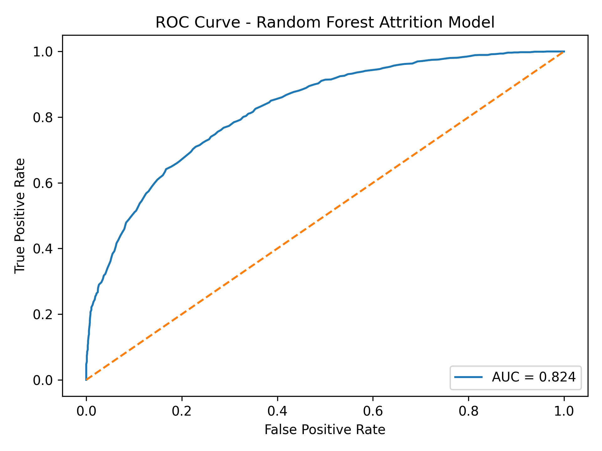
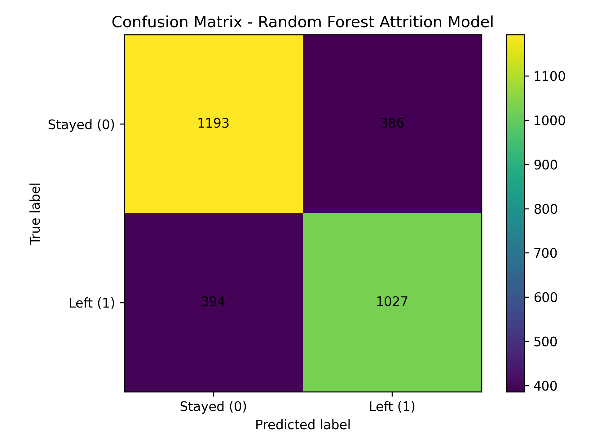
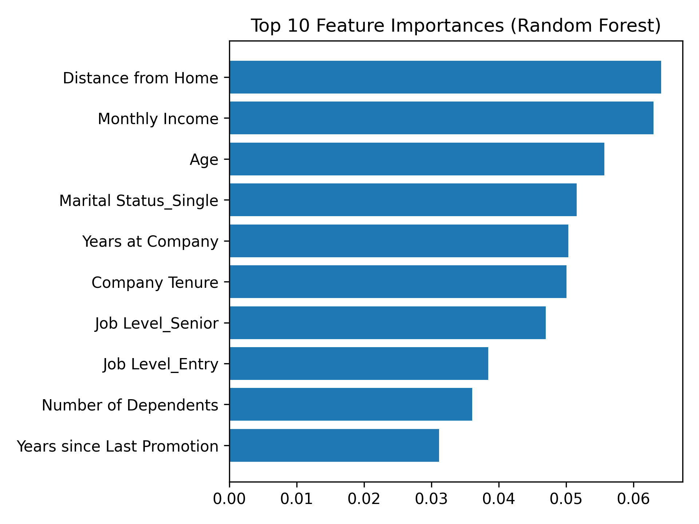
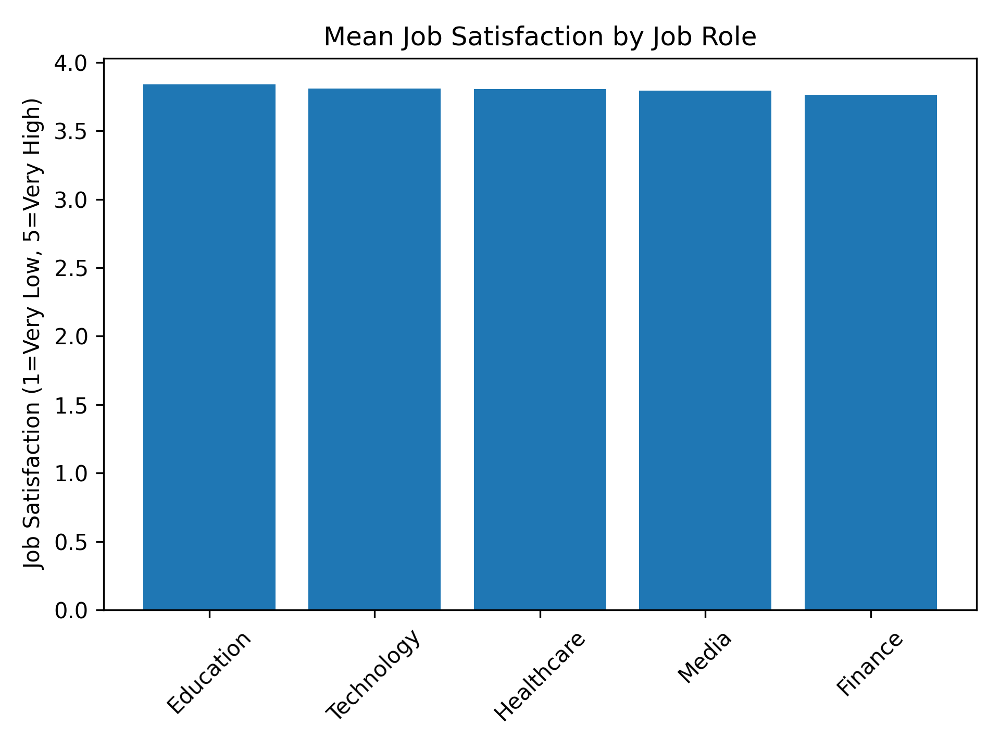

# Employee Attrition Analytics & Scalable Data Architecture

## Project Overview

This project explores employee attrition using data analytics and machine learning techniques to identify factors associated with employee resignation and retention.

The project demonstrates an end-to-end analytics workflow including data preprocessing, exploratory analysis, predictive modelling, model evaluation, relational database design, scalable data architecture, and responsible handling of employee data.

## Project Objectives

- Analyse factors associated with employee attrition
- Prepare and transform employee data for machine learning
- Compare Logistic Regression and Random Forest approaches
- Identify important predictors of employee resignation and retention
- Evaluate classification performance using multiple metrics
- Explore relationships between job satisfaction, work-life balance and job role
- Design a relational data model for structured HR data
- Consider scalable architectures for large-scale employee analytics
- Address privacy and responsible use of employee data

## Dataset

The analysis uses an employee dataset containing demographic, employment and workplace-related attributes.

Example features include:

- Age
- Job Role
- Monthly Income
- Job Satisfaction
- Work-Life Balance
- Company Tenure
- Job Level
- Remote Work
- Distance from Home
- Years Since Last Promotion
- Attrition

The target variable represents whether an employee stayed with or left the organisation.

## Data Preparation

The preprocessing workflow includes:

- Removal of non-predictive identifiers
- Validation of missing values
- Separation of predictor and target variables
- One-hot encoding of categorical features
- Standardisation where required
- Creation of a cleaned dataset for analysis

## Predictive Modelling

Two machine learning approaches were used:

### Logistic Regression

Logistic Regression was used to examine the direction and relative strength of relationships between employee characteristics and attrition.

### Random Forest

A Random Forest classifier was used to capture non-linear relationships, rank feature importance and predict employee attrition.

The final model was evaluated using a stratified train-test split.

## Model Performance

The Random Forest model achieved approximately:

- **Accuracy: 74%**
- **ROC AUC: 0.824**

Performance was further evaluated using a classification report, confusion matrix and ROC curve.

### ROC Curve

### Confusion Matrix

## Key Findings

The analysis identified several factors with notable predictive relationships to employee attrition.

Important features included:

- Distance from Home
- Monthly Income
- Age
- Marital Status
- Years at Company
- Company Tenure
- Job Level
- Number of Dependents
- Years Since Last Promotion

Company Tenure showed a strong predictive association with retention when compared with Monthly Income and Job Satisfaction.

Job Satisfaction and Work-Life Balance showed very little linear correlation in this dataset.

### Feature Importance

### Job Satisfaction by Job Role

## Database Design

A relational database design was developed to demonstrate how employee information could be migrated from flat-file storage into a structured relational system.

The design applies Third Normal Form (3NF) principles to reduce redundancy and improve data consistency.

## Scalable Data Architecture

A conceptual distributed architecture was considered for supporting significantly larger employee datasets.

Technologies explored include:

- Distributed data storage
- Apache Spark
- Apache Kafka
- Stream processing
- Data warehouses and lakehouse architectures

The architecture supports both large-scale batch analytics and near-real-time processing.

## Privacy & Responsible Analytics

Employee analytics involves sensitive personal and employment information.

Key considerations include:

- Data minimisation
- Purpose limitation
- Access control
- Encryption
- Pseudonymisation
- Profiling risks
- Bias monitoring
- Human oversight of automated predictions

Predictive models should support organisational decision-making rather than replace appropriate human judgement.

## Technologies & Skills

- Python
- Pandas
- NumPy
- Scikit-learn
- Matplotlib
- Logistic Regression
- Random Forest
- Data Preprocessing
- Feature Engineering
- Machine Learning Evaluation
- SQL
- Relational Database Design
- Big Data Architecture
- Data Privacy

## Disclaimer

This repository is a portfolio project demonstrating data analytics, machine learning and data architecture concepts using an employee attrition scenario.

The analysis is intended for portfolio demonstration purposes and should not be used to make real-world employment decisions.
