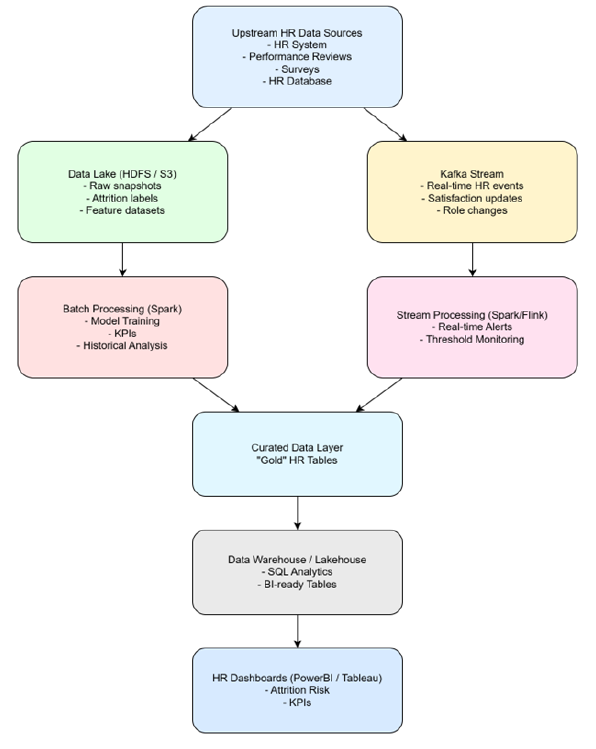

# Scalable Data Architecture

This architecture demonstrates a scalable approach for storing, processing and analysing employee data from multiple HR sources.

## Architecture Overview

The proposed design combines batch and real-time data processing:

- **Upstream HR Data Sources** provide data from HR systems, performance reviews, surveys and HR databases.
- **Data Lake (HDFS / S3)** stores raw snapshots, attrition labels and feature datasets.
- **Apache Spark** supports batch processing for model training, KPI calculation and historical analysis.
- **Apache Kafka** supports real-time HR event streaming, including satisfaction updates and role changes.
- **Stream Processing (Spark / Flink)** enables real-time monitoring and alerts.
- **Curated Data Layer** stores prepared HR datasets for downstream analytics.
- **Data Warehouse / Lakehouse** supports SQL analytics and BI-ready tables.
- **Power BI / Tableau** can provide dashboards for KPIs and aggregated attrition-risk insights.

## Design Considerations

The architecture separates storage, batch processing and streaming workloads so that each component can scale independently. A data lake supports large volumes of raw and historical data, while distributed processing technologies support scalable analytics.

The design also introduces additional operational complexity compared with a traditional relational database, so the choice of components should depend on data volume, processing requirements and the need for real-time analytics.
