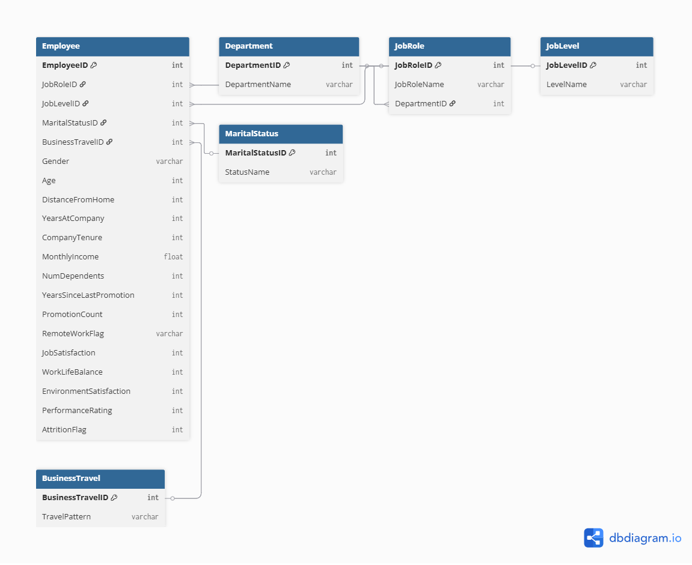

# Database Design

This folder contains the relational database design for the employee attrition analytics project.

The database uses a normalised relational structure with the Employee table as the central entity and supporting tables for job roles, departments, job levels, marital status and business travel.

## Entity Relationship Diagram

The ERD demonstrates the use of primary keys and foreign keys to organise employee data and reduce unnecessary data duplication.
